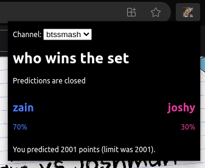
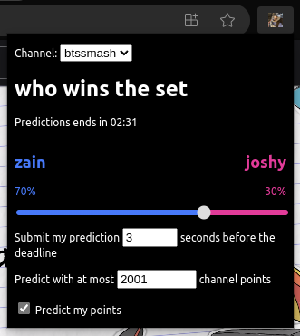
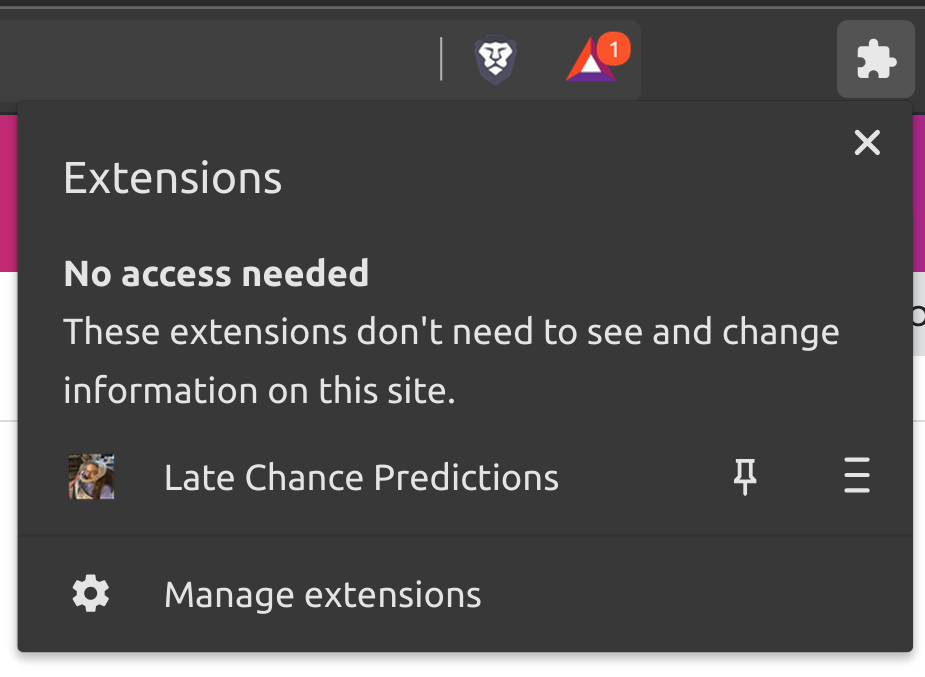

# Last Chance Predictions

Last Chance Predictions is a browser extension which intelligently gambles your
Twitch channel points. Pick your odds and a point limit, and Last Chance
Predictions will automatically calculate which side to bet and how many points
to bet and submit your prediction just in time!

Last Chance Predictions is written in JavaScript (with some accidental
TypeScript).

Last Chance Predictions currently only works in Chromium-based browsers such as
Google Chrome, Brave, and Microsoft Edge.

## Installation

1. Open a Chromium-based browser.
2. In your browser's URL bar, enter `about:extensions`.
3. Enable developer mode by checking the "Developer mode" checkbox:
   1. Google Chrome: Top right of the window
   2. Brave: Top right of the window
   3. Microsoft Edge: In the left panel
4. Click "Load unpacked" button:
   1. Google Chrome: Top left of the window
   2. Brave: Top left of the window
   3. Microsoft Edge: Top right of the window
5. Choose the `extension` directory in your Last Chance Predictions checkout.

## Predicting

1. Open the extensions panel in your browser's toolbar and **pin** the Last
   Chance Predictions extension.
   
2. Open a Twitch stream.
3. Wait for a prediction to become active in the stream you're watching.
4. Click the Last Chance Predictions extension icon in your toolbar.
5. Drag the slider to change your guess on the odds of each outcome. For
   example, if you think the pink outcome is very likely, drag the slider to the
   left such that the pink outcome is 80% (thus the blue outcome is 20%).
6. Choose the maximum number of points you're willing to bet. Last Chance
   Predictions might bet this number or a smaller number.
7. Check the "Predict my points" checkbox to commit to predicting. Feel free to
   close the Last Chance Predictions pop-up; it will bet for you in the
   background.

## Known issues

* Predictions with more than two outcomes are not supported.
* You must refresh your Twitch tab after installing the extension.

## License & copyright

Copyright 2023 Matthew "strager" Glazar, Max Coplan

License: [AGPL-3.0-or-later](./LICENSE.txt)
